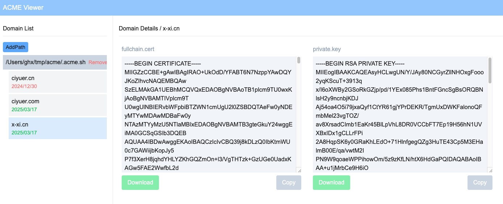

# ACME Viewer

Web viewer for acme.sh , show certificates live domain ssl key on web page.



## dependencies

- nodejs 18+
- nextjs

## Build and run 

```bash
npm run dev
# or
yarn dev
```

## Config

The config parameters is in .env file 

```shell
# login user
AUTH_USER=admin
# login password
AUTH_PASS=admin1234
# login salt , random string 
AUTH_SALT=354120C6-C7A5-48C4-AD87-E2CEAE7A032D
```

## Usage  

### Clone repo

```shell
# clone repo
git clone https://github.com/DennisGuo/acme-viewer.git

# install dependencies
cd acme-viewer
npm install

# build
npm run build
# run 
npx next start -p 8080
```

### Deoploy with systemd

```shell

# copy service file to /etc/systemd/system
sudo systemctl daemon-reload

# start on boot
sudo systemctl enable acme-viewer

# start service
sudo systemctl start acme-viewer

# stop service
sudo systemctl stop acme-viewer

# restart service
sudo systemctl restart acme-viewer

# check status
sudo systemctl status acme-viewer

# check logs
sudo journalctl -efu acme-viewer

```